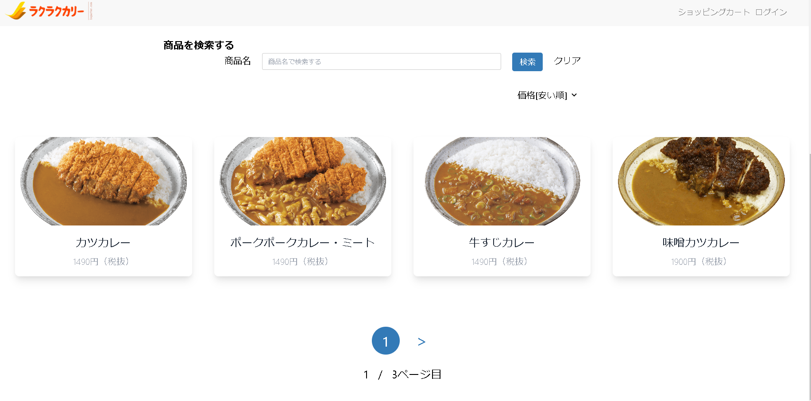
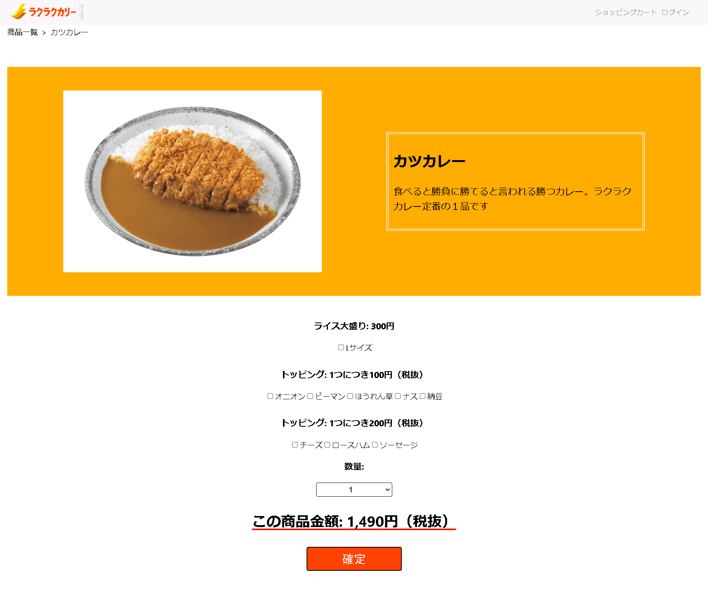
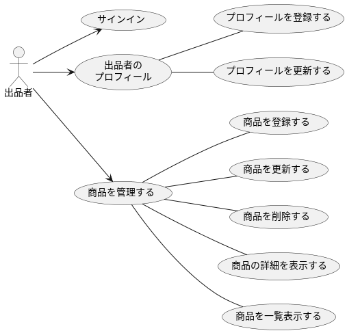

[Next.js](https://nextjs.org/)を使用した架空のECサイトです。

## 開発概要

### 1.ECサイトについて
商品一覧画面


商品詳細画面


### 2.開発フロー
ウォーターフォール型の開発です。要件定義と設計は既存のユースケースを使用したため、実装以降の部分を担当しました。



［使用したユースケース図］

### 3.使用した技術

使用した言語：Typescript

フレームワーク：Next.js(14.2.23), Jest, React-testing-library

データベース：JSONで仮想のデータベースを使用

## 開発環境

### セットアップ

[Yarn](https://yarnpkg.com/) を使用しています。

プロジェクトを clone した後、以下を実行して開発サーバを起動してください。

1. 環境変数の設定

  [env.sample](/env.sample) をコピーして、`.env` ファイルを作成します。内容は、必要であれば適宜書き換えてください。

  ```sh
  cp env.sample .env
  ```

1. モジュールのダウンロード

    ```sh
    yarn install
    ```

1. バックエンド（モック）サーバの起動

    現状、アプリケーションの動作のためにバックエンドサービスが必要です。
    モックサーバを別のシェルから起動してください。

    ```sh
    yarn mock-api
    ```

1. 開発サーバの起動

    デフォルトでは 3000 番ポートで起動します。

    ```sh
    yarn dev
    ```
